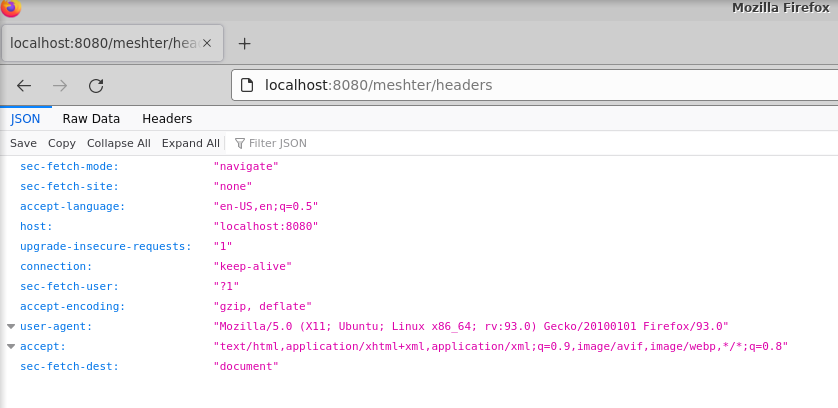

Arguable every (web) developer needed at some point in their career to inspect the HTTP headers that her application receives. While inspecting these headers is very easy if their source is the client's web browser there are a few situations where reading them is a little bit more difficult. Here are some examples:
* **Reverse proxy-ing**. It is common to use web servers like Apache HTTPD or NGINX as reverse proxy for your application server(s). With the advent of cloud computing, such techniques have been replaced by PaaS systems (load balancers) and troubleshooting those is sometimes even more difficult.
* **Headers manipulation and augmentation**. There are many examples of protocols and techniques where the original headers received from a client are either changed (not that frequent) or enhanced (more frequent, especially when new headers are added).

As a matter of fact, this utility has been originally designed to troubleshoot the [Shibboleth integration with Azure AD](src/docs/shibboleth-azure-ad.md).

# User's Guide
To use this tool, follow these simple steps:
1. Make sure you have a Java JRE 11+ version available on your system.
2. Download the utility from [the releases page](https://github.com/TomsTools/headers-reader/releases/download/2.5.5/headers-reader-2.5.5.jar).
3. The tool gets started with the following command (it will start a web server listening on port 8080):
```bash
$ java -jar headers-reader-2.5.5.jar
```
4. Once the tool starts, you will see a set of logs and one indication of the tool running successfully is this log snippet:
```
Tomcat started on port(s): 8080 (http) with context path '/meshter'
```
5. Once started, you can test it by viewing the HTTP headers (we present just a few ways):
    - Using a tool like `curl`:
    ```bash
    curl http://localhost:8080/meshter/headers
    ```
    ... would produce this type of output:
    ```json
    {"host":"localhost:8080","user-agent":"curl/7.68.0","accept":"*/*"}
    ```
    - Using simply the web browser (just navigate to the above mentioned URL):
    
6. For more useful integrations (like reverse proxy-ing), the utility logs the headers to the console. From the examples above, here is the output produced in the console:
    ```
    ***
    [host]=[localhost:8080]
    [user-agent]=[curl/7.68.0]
    [accept]=[*/*]
    ***
    ```

Enjoy :slightly_smiling_face:!
