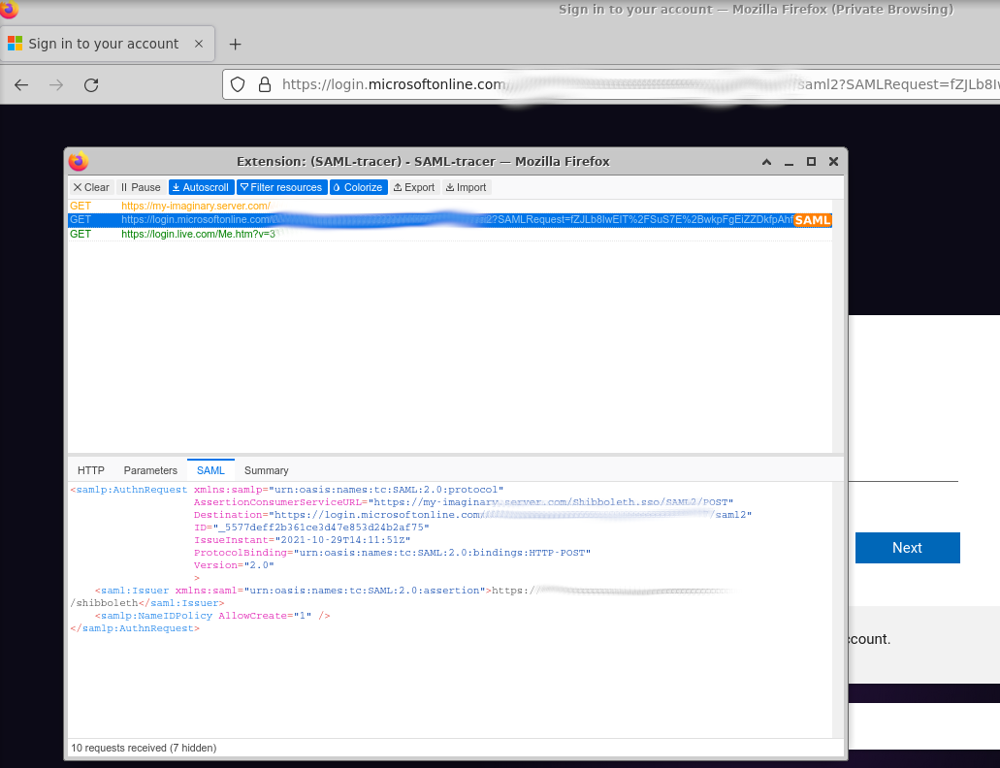
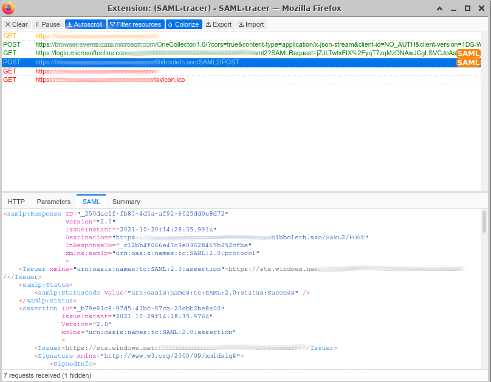

This guide focuses on configuring identity federation using SAML on a software stack backed by [Apache 2.4](https://httpd.apache.org/docs/2.4/), [Shibboleth 3](https://shibboleth.atlassian.net/wiki/spaces/SP3/overview) as service provider (SP) and [Azure's AD](https://azure.microsoft.com/) as identity provider (IdP).

The following procedures have been tested on CentOS 8 but they are expected to work on any other RHEL 8-based distribution.

Before we start, I will give credit (and direct you) to Rohan Islam's page on [Azure AD SAML federation using Shibboleth](https://rohanislam2.medium.com/azure-ad-saml-federation-using-shibboleth-sp-ad40f9c94eab). That page covers the following:
- Federation concepts 
- Setting up Azure AD
- Configuring Apache HTTPD and Shibboleth

After reading Rohan's material you might ask yourself "well, why any additional material, since that page covers so much!?". The answer is quite simple: the page doesn't cover how to read the attributes coming from IdP and sometimes that can be a struggle.

So, let's jump to the technicalities :slightly_smiling_face:...

# Installation Layout
To create a context, let's look at our setup first...
## Installation
For this experiment we use the following components:
- Apache HTTPD 2.4 (installed using the command `dnf install httpd mod_ssl`).
- Shibboleth 3 (installation instructions are available on [Shibboleth's Wiki](https://shibboleth.atlassian.net/wiki/spaces/SP3/pages/2065335566/RPMInstall); even though the instructions refer to RHEL 7, they worked for CentOS 8 as well).
- The [headers utility](../..) to check the value of the headers we receive from Azure AD.
You will find all the relevant files [next to this file](.).

## Apache HTTPD Configuration Files
The configuration files for the `httpd` package are available under `/etc/httpd`. We are going to focus on two of them (in the experimental setup we configured SSL as well, but there are plenty of tutorials on how to do that, so we'll skip it):
1. `/etc/httpd/conf.d/proxy.conf` is the file where we configure the reverse proxy to the [utility](../..) that reads the headers Azure AD sends to us. Here is the content of that file:
    ```
    ProxyPass "/meshter" "http://127.0.0.1:8080/meshter"
    ProxyPassReverse "/meshter" "http://127.0.0.1:8080/meshter"
    ```
    >  :warning: This assumes that the utility runs on the same server where the HTTPD server runs.
2. `/etc/httpd/conf.d/shib.conf` is a file provided by the Shibboleth package. At the end of the file we will do the following changes:
    ```xml
    <Location /meshter>
      AuthType shibboleth
      ShibRequestSetting requireSession true
      ShibUseHeaders On
      require shib-session
    </Location>
    ```
    Some notes related to these changes:
    - The `Location` will point to our own web context.
    - We will activate [`ShibUseHeaders On`](https://shibboleth.atlassian.net/wiki/spaces/SP3/pages/2065335062/Apache).
    > :warning: As per [this paragraph](https://shibboleth.atlassian.net/wiki/spaces/SP3/pages/2065335299/SpoofChecking#SpoofChecking-Apache) headers should not be used because of the security implications. It is beyond the scope of this tutorial to deep-dive the topic, but consider designing your app to adhere to [these recommendations](https://shibboleth.atlassian.net/wiki/spaces/SP3/pages/2065335257/AttributeAccess).

## Shibboleth Configuration Files
Now, let's focus on the files specific to Shibboleth:
1. `/etc/shibboleth/shibboleth2.xml` would be the first file to edit/analyze (and is the main configuration file):
    - The following line is very useful for troubleshooting:
        ```xml
        <OutOfProcess tranLogFormat="|%u|%s|%IDP|%i|%ac|%t|%attr|%n|%b|%E|%S|%SS|%L|%UA|%a" />
        ```
        This defines the format of the log entries that will be generated to `/var/log/shibboleth/transaction.log`. The definition of each variable can be found [here](https://shibboleth.atlassian.net/wiki/spaces/SP3/pages/2065334602/Logging). Pay close attention to `%n` and `%u` (the subject and the REMOTE_USER). We will discuss about these later on.
    - Assuming our web-server is called `my-imaginary.server.com` and the attribute we are interested in is called `my-subject` (to fill in the value for REMOTE_USER), we will alter the application defaults like this:
        ```xml
        <ApplicationDefaults entityID="https://my-imaginary.server.com/shibboleth"
            REMOTE_USER="my-subject"
        ```
    - Rohan's article referenced above documents how to configure your entity ID in Azure AD. We will use that value to alter the SSO configuration (the `xxx-...-xxx` should be replaced by your entity ID):
        ```xml
            <SSO entityID="https://sts.windows.net/xxxxxxxx-xxxx-xxxx-xxxx-xxxxxxxxxxxx/">
              SAML2
            </SSO>
        ```
    - The following line gets un-commented because the `partner-metadata.xml` will contain Azure AD's metadata (this file contains elements like the `X509Certificate`):
        ```xml
        <MetadataProvider type="XML" validate="true" path="partner-metadata.xml"/>
        ```
2. `/etc/shibboleth/attribute-map.xml` is the file defining how we map the attributes from the IdP to attributes (headers in our case) we want to use in our applications. Here are some details:
    - Probably the most important attribute is the subject. This is how we read it:
        ```xml
        <Attribute name="urn:oasis:names:tc:SAML:1.1:nameid-format:unspecified" id="my-subject">
            <AttributeDecoder xsi:type="NameIDAttributeDecoder" formatter="$Name" defaultQualifiers="true"/>
        </Attribute>
        ```
        It is important to note that:
        - in the `shibboleth2.xml` file we made a change that will set the REMOTE_USER to the value stored in `my-subject`.
        - in the next section will describe _how_ we identified the attributes we wanted to associate.
    - Other attributes are expressed like this (the attached file contains more attributes):
        ```xml
            <Attribute name="http://schemas.xmlsoap.org/ws/2005/05/identity/claims/emailaddress" id="my-emailaddress" nameFormat="urn:oasis:names:tc:SAML:2.0:attrname-format:unspecified"/>
            <Attribute name="http://schemas.xmlsoap.org/ws/2005/05/identity/claims/givenname" id="my-givenname" nameFormat="urn:oasis:names:tc:SAML:2.0:attrname-format:unspecified"/>
        ```
At this point it is expected that the reader will feel a little lost (we presented a bunch of configuration files filled with _magic_ values). The next section will attempt to demystify these...
# Connecting the Dots
The previous section presented the layout and the configuration files but doesn't give an explanation for those values (this is why we are calling this section "connecting the dots").
## Enabling Azure AD
[Rohan's article](https://rohanislam2.medium.com/azure-ad-saml-federation-using-shibboleth-sp-ad40f9c94eab) would definitely get you to the point where you will have a successful integration with Azure AD. We will not focus on that part here.
## Understanding the SAML Attributes
Now it's time to focus on the communication between your browser, Apache HTTPD/Shibboleth and Azure AD. For this we will use Firefox as a browser with an extension called [`SAML-tracer`](https://addons.mozilla.org/en-US/firefox/addon/saml-tracer/).
1. Let's try to access [https://my-imaginary.server.com/](https://my-imaginary.server.com/) and activate the SAML-tracker. We will be able to observe the following traffic:

The orange `SAML` icon is the indicator of SAML traffic and if you click on the SAML tab you will be able to introspect it.
2. Just follow the authentication process (username/password/MFA) and keep recording that happens on the SAML side:
.
3. At this moment let's focus on the `POST` method's traffic to the `Shibboleth.sso/SAML2/POST` service (the XML traffic is redacted and [attached](saml-azure-ad.xml)):
    - Earlier we presented how we interpret the `subject` (in the `attribute-map.xml`). Here are the details:
        ```xml
        <Subject>
            <NameID Format="urn:oasis:names:tc:SAML:1.1:nameid-format:unspecified">TomTheFatCat</NameID>
            <SubjectConfirmation Method="urn:oasis:names:tc:SAML:2.0:cm:bearer">
                <SubjectConfirmationData InResponseTo="xxx"
                                         NotOnOrAfter="2021-10-29T15:28:35.804Z"
                                         Recipient="https://my-imaginary.server.com/Shibboleth.sso/SAML2/POST"
                                         />
            </SubjectConfirmation>
        </Subject>
        ```
        Observe how the `urn:oasis:names:tc:SAML:1.1:nameid-format:unspecified` format is linked to the `my-subject` attribute.
    - We are also able to see the presence of other attributes (like the email address):
        ```xml
        <Attribute Name="http://schemas.xmlsoap.org/ws/2005/05/identity/claims/emailaddress">
                <AttributeValue>tom.the.fat.cat@server.com</AttributeValue>
        </Attribute>
        ```
## Inspecting the Headers
Using our small utility, one can check if the headers we expect are presented correctly to the application server. Here is a snippet from the tool's output:
```
10/31/2021 11:30:57.386 [DEBUG] com.github.meshter.http.headers.HeadersController - Headers are:
***
[host]=[my-imaginary.server.com]
[user-agent]=[Mozilla/5.0 (X11; Ubuntu; Linux x86_64; rv:93.0) Gecko/20100101 Firefox/93.0]
[accept]=[text/html,application/xhtml+xml,application/xml;q=0.9,image/avif,image/webp,*/*;q=0.8]
[accept-language]=[en-US,en;q=0.5]
[accept-encoding]=[gzip, deflate, br]
[cookie]=[_shibsession_64656661756c7468747470733a2f2f65752d617070732e6f70612e7369656d656e732d656e657267792e636f6d2f73686962626f6c657468=_d0be90f8b03830bd6c973cd964719833]
[upgrade-insecure-requests]=[1]
[sec-fetch-dest]=[document]
[sec-fetch-mode]=[navigate]
[sec-fetch-site]=[none]
[sec-fetch-user]=[?1]
[cache-control]=[max-age=0]
[shib-cookie-name]=[]
[shib-session-id]=[_d0be90f8b03830bd6c973cd964719833]
[shib-session-index]=[_e26ff523-0d9d-4a5f-915a-aeb2220b9a00]
[shib-session-expires]=[1635708419]
[shib-session-inactivity]=[1635683457]
[shib-identity-provider]=[https://sts.windows.net/xxxxxxxx-xxxx-xxxx-xxxx-xxxxxxxxxxxx/]
[shib-authentication-method]=[urn:oasis:names:tc:SAML:2.0:ac:classes:PasswordProtectedTransport]
[shib-authentication-instant]=[2021-10-22T19:19:21.007Z]
[shib-authncontext-class]=[urn:oasis:names:tc:SAML:2.0:ac:classes:PasswordProtectedTransport]
[shib-authncontext-decl]=[]
[shib-assertion-count]=[]
[shib-handler]=[https://my-imaginary.server.com/Shibboleth.sso]
[my-subject]=[TomTheFatCat]
[my-emailaddress]=[tom.the.fat.cat@server.com]
[my-givenname]=[Tom]
[my-surname]=[Cat]
[shib-application-id]=[default]
[remote_user]=[TomTheFatCat]
[x-forwarded-host]=[my-imaginary.server.com]
[x-forwarded-server]=[my-imaginary.server.com]
[connection]=[Keep-Alive]
***
```
Try to focus on the headers prefixed by `my-` and `shib-` text.

When these requests are sent to the server, you should also be able to visualize some of the attributes in Sibboleth's own transaction log (it can be found under `/var/log/shibboleth/transaction.log`).
## Security Aspects
As we alluded in the above paragraph, leveraging the headers as means for authentication is a security risk (e.g. the risk of [header spoofing](https://shibboleth.atlassian.net/wiki/spaces/SP3/pages/2065335299/SpoofChecking)). As a product, shibboleth "goes the extra-mile" in recommending proper ways to transfer the authentication information (like using [server-side variables for Java backends](https://shibboleth.atlassian.net/wiki/spaces/SP3/pages/2067400159/JavaHowTo)) but this setup might be a little more laborious to achieve. While these will not be substitutes for a proper security check, we can advice that:
- you should be in complete control of the authentication headers you use.
- you should protect your applications server from direct connections that will allow headers spoofing (activate a firewall that allows connections only from your web server to the application server).

The list might continue, but this will go beyond the scope of this page...

# Conclusions
While leveraging the HTTPD headers for authentication is a risky approach from a security standpoint, it is a very pragmatic and simple way for integrating your IAM infrastructure with your applications. Just don't forget to do your homework when it comes to security...